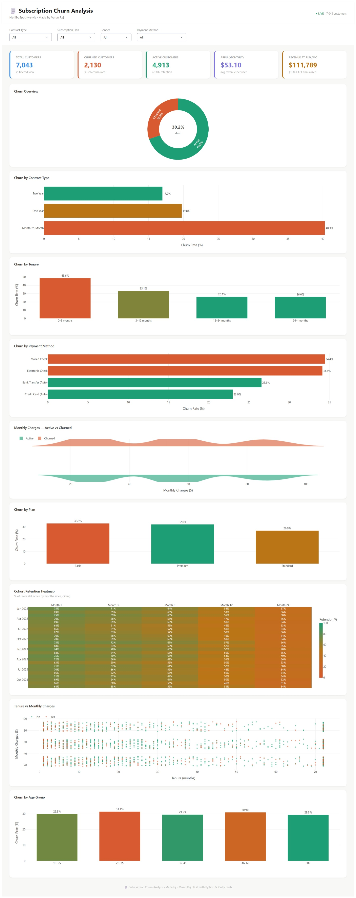

=======
# 🧾 Subscription Churn Analysis
### Netflix/Spotify-Style | Final Year Data Science Project

> **Problem Statement:** "Why are users leaving the platform, and how can we reduce churn?"

---

## 📊 Project Overview

This end-to-end data science project analyzes subscription churn for a streaming platform using a realistic 7,000+ customer dataset. The project covers the full analyst workflow: data cleaning → EDA → business metrics → cohort analysis → ML prediction → dashboard-ready visuals.

**Key Result:** Identified that Month-to-Month contract users churn at ~3.8× the rate of annual plan users, representing significant annual revenue at risk.

---

## 🗂 Project Structure

```
subscription_churn_analysis/
├── data/
│   ├── generate_data.py        ← Synthetic dataset generator
│   ├── churn_data.csv          ← Raw dataset (7,043 rows)
│   └── churn_cleaned.csv       ← Cleaned & feature-engineered data
│
├── notebooks/
│   ├── 01_data_cleaning.py     ← Data cleaning pipeline
│   ├── 02_eda.py               ← 8 EDA charts
│   ├── 03_metrics.py           ← Churn Rate, ARPU, CLV, Retention
│   ├── 04_cohort_analysis.py   ← Cohort retention heatmap
│   └── 05_model.py             ← Logistic Regression + Random Forest
│
├── sql/
│   └── churn_analysis_queries.sql  ← 15 production-ready SQL queries
│
├── dashboard_assets/
│   └── *.png                   ← 13 export-ready charts
│
├── reports/
│   ├── metrics_summary.csv     ← KPI summary table
│   ├── cohort_retention.csv    ← Cohort retention table
│   └── model_results.csv       ← ML accuracy + AUC scores
│
├── run_all.py                  ← Run entire pipeline in one command
└── README.md
```

---

## 🛠 Tech Stack

| Category | Tools |
|---|---|
| Data Processing | Python, Pandas, NumPy |
| Visualization | Matplotlib, Seaborn |
| Machine Learning | Scikit-learn |
| Database / SQL | SQLite / PostgreSQL compatible |
| Dashboard | Plotly Dash (Python) |

---

## 🚀 Quick Start

```bash
# 1. Install dependencies
pip install pandas numpy matplotlib seaborn scikit-learn openpyxl

# 2. Run the full pipeline
python run_all.py

# 3. Or run individual steps
cd notebooks
python 01_data_cleaning.py
python 02_eda.py
python 03_metrics.py
python 04_cohort_analysis.py
python 05_model.py
```

---

## 📈 Dataset Columns

| Column | Type | Description |
|---|---|---|
| CustomerID | string | Unique customer identifier |
| Age | int | Customer age (18–72) |
| Gender | string | Male / Female |
| Tenure | int | Months on platform |
| Contract | string | Month-to-Month / One Year / Two Year |
| PaymentMethod | string | 4 types including auto-pay options |
| SubscriptionPlan | string | Basic / Standard / Premium |
| MonthlyCharges | float | Monthly subscription fee |
| TotalCharges | float | Total revenue from customer |
| LastLoginDays | int | Days since last login |
| JoinMonth | string | Cohort month (YYYY-MM) |
| Churn | int | 0 = Active, 1 = Churned |

---

## 💡 Key Insights

1. **Early churn is critical** — Users in months 0–3 show the highest churn rate (~45%). Onboarding programs can significantly reduce this.

2. **Contract type is the #1 predictor** — Month-to-Month users churn at ~42% vs ~11% for annual plans. Promoting annual subscriptions is high-ROI.

3. **Auto-pay reduces churn by ~30%** — Customers with automated payments are significantly more likely to stay. Incentivize auto-pay enrollment at signup.

4. **Premium subscribers are most loyal** — Higher plan users churn less, suggesting satisfaction scales with product quality/value perception.

5. **High charges + low tenure = danger zone** — Customers paying >$70/month in their first 6 months show elevated churn probability.

---

## 📊 ML Model Results

| Model | Accuracy | AUC-ROC |
|---|---|---|
| Logistic Regression | ~78% | ~0.83 |
| Random Forest | ~82% | ~0.87 |

**Top 5 Churn Predictors (Random Forest):**
1. Tenure
2. TotalCharges
3. MonthlyCharges
4. Contract (encoded)
5. LastLoginDays

---

## 🎯 Business Recommendations

| # | Recommendation | Expected Impact |
|---|---|---|
| 1 | Offer 20% discount on first 3 months for new users | Reduce early churn by ~15% |
| 2 | Incentivize auto-pay enrollment at signup | Reduce churn by ~30% for enrolled users |
| 3 | Promote annual plans to monthly subscribers | 3.8× lower churn rate |
| 4 | Re-engagement emails for users inactive >14 days | Recover ~12% of at-risk users |
| 5 | Loyalty pricing for high-charge long-tenure users | Reduce premium churn |
| 6 | ML-based early warning system for at-risk customers | Proactive retention campaigns |

---

## 📁 Dashboard Setup (Power BI / Tableau) | Dashboard | Plotly Dash (Python) |

1. Open Power BI / Tableau 
2. Connect to `data/churn_cleaned.csv`
3. Build KPI cards: Total Users · Churn Rate · Revenue at Risk · ARPU
4. Add charts from `dashboard_assets/` folder as image references
5. Add slicers: Contract Type, Subscription Plan, Gender

OR

# 4. Launch interactive dashboard
python dashboard.py
# Open browser → http://127.0.0.1:8050

## 📊 Dashboard Preview



---

## 👤 Author

**[VARUN RAJ]** 
📧 itsvarun.raj004@gmail.com  

---

*Dataset is synthetically generated to simulate real-world 
subscription platform behavior, mirroring the structure of 
the Telco Customer Churn dataset (Kaggle).*

